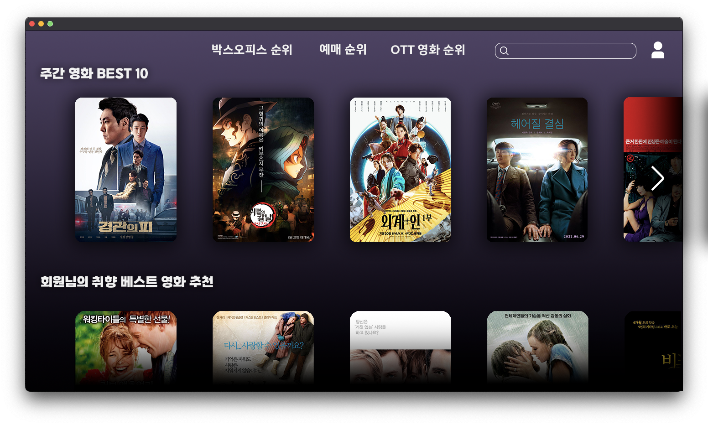
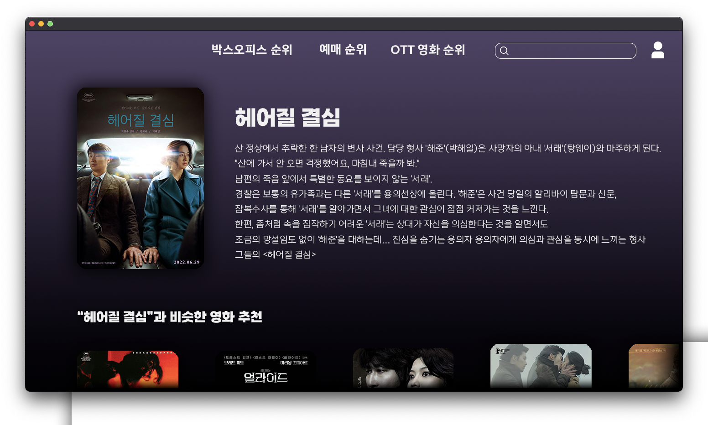
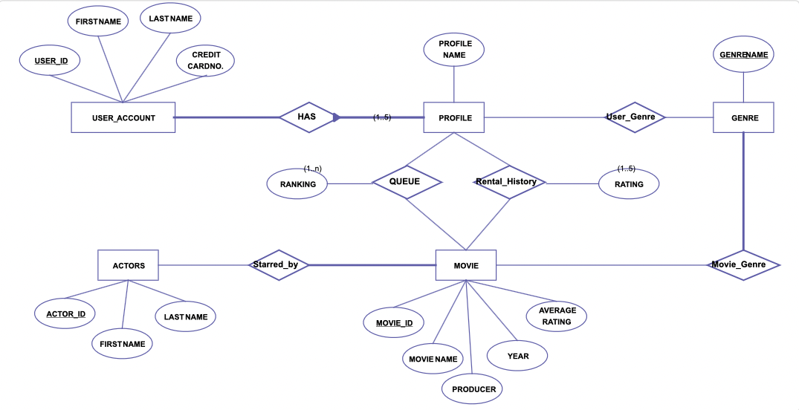

# movieRecommed

####  소개

___

##### 작성 목적

7조, 13조가 선정한 서비스는 영화 추천 서비스입니다.

 이 설계서는 7조, 13조가 영화 추천 서비스에 대해 알아본 것을 바탕으로 유사 서비스 분석, 데이터 흐름도, 사용된 오픈소스, E-R 다이어그램, 오픈소스 정리, 서비스 제공 방법 등을 설명하고 정리하기 위해 작성했습니다.

___

##### 배경

 영화 추천 서비스를 선정한 이유는 근래 쉽게 자신이 원하는 영화나 드라마를 원하는 시간에 볼 수 있는 ott 서비스가 많이 출시되고 인기가 높아졌습니다.

이처럼 많은 사람들에게 친근한 서비스이기에 특별히 다른 차별화를 시키기보다는 해당 ott 서비스를 비교, 분석하고 어떤 원리로 구동되는지 알아보기 위함입니다.

___

##### 역할

이번 과제를 위해 서비스 선정, 선정된 서비스 구체화, 서비스 소개, 유사 서비스 분석, 시스템 설계 내용 요약, dfd 작성, 필요한 오픈소스 조사, git hub 사용, PR, 발표, 사용하는 오픈소스 조사 및 소개 등 필요한 작업을 각 조원이 각자 맡은 역할에 따라 나눠서 진행했습니다.

___

##### 기능

 7조, 13조가 구상한 영화 추천 서비스는 웹 기반 서비스로서 서비스 이용자의 연령, 국가, 성별, 취향 즉, 사용자가 입력한 기본 정보와 서비스를 사용하면서 쌓이는 데이터 등을 바탕으로 오픈소스(React, React Native, Bootstrap, Django, peewee, Elastic search, Pytorch FM)가 상호작용하며 사용자별 맞춤 추천 영화를 제공해주는 기능을 가지고 있습니다.

또한 주간 영화 BEST, 박스오피스 순위, 예매 순위, OTT 영화 순위 등의 현재 인기 있는 영화나 장르별 추천이 가능합니다.

이를 바탕으로 서비스 이용자는 데이터 기반으로 추천되는 영화뿐만 아니라 찾고 있는 영화나 영화의 정보 등을 폭넓게 알 수 있게 됩니다.

___

## 유사 서비스 분석

재  추천 서비스는  다양한 플랫폼에서 사용중이다 주제인 영화를 추천해주는 서비스뿐만 아니라 쇼핑몰 혹은 유튜브 등 많은 곳에서 상용화 되어있다. 영화 추천 서비스를 사용중인 플랫폼은 대표적으로 넷플릭스 웨이브 왓챠 디지니플러스 외에도 대부분의 OTT 서비스에서 사용중이다.

1. **넷플릭스**

   - 넷플리스에는 다양한 장점들이 있다. 다수의 자체 제작 콘텐츠를 보유하고 국내 영상에도 자막을 제공한다 또한 영화 추천 서비스에 대한 다양한 알고리즘들을 믹스한 하이브리드 추천 시스템을 적용하였다. 현재에도 지속적으로 추천 알고리즘 서비스에 대한 관심도도 높을뿐더라 진화 시키고 있다. 넷플릭스의 경우 같은 콘텐츠라도 나라에 따라, 문화권에 따라 썸네일까지 변화하며 같은 콘텐츠에 도 다양한 표지 이미지를 사용함으로써 선호도에 따른 표지 이미지를 다르게 적용한다. 예를 들어 라라랜드란 영화를 추천할 경우에 뮤지컬 관련 OTT를 선호하는 사용자에게는 주인공들이 춤추는 장면을 로맨스 관련 OTT를 선호하는 사용자에게는 주인공들이 키스하는 장면을 메인 이미지로 내세우면서 사용자들에게 다양한 방법으로 추천해준다.

   ---

2. **왓챠**

   - 왓챠는 오리지널 콘텐츠는 없지만 익스클루시브 콘텐츠를 보유하고 있다. 익스클루시브 콘텐츠란 왓챠에서만 감상 가능한 독점 콘텐츠라는 뜻이다. 또한 다중 언어 자막 서비스를 지원하고 왓챠피디아를 보유하고 있다. 왓챠 피디아는 왓챠와 위키피디아의 합성어로 다양한 콘텐츠에 대한 정보, 리뷰, 평점 그리고 감상 가능한 사이트를 알려주는 서비스이다. 왓챠의 가장 큰 매력은 처음 사용자가 이용하기전에 15개 이상의 영화에 별점을 매기게 하고 데이터를 이용해 비슷한 취향을 찾아서 관련 컨텐츠를 사용자에게 추천해주는 매력적인 추천 서비스를 보유하고 있다.

   ---

3. **웨이브**

   - 웨이브는 인공지능을 통해 인스타 태크 같이 태그를 기반으로 유사한 영화들을 추천해준다. 사용자가 송강호가 주인공인 영화를 시청한다면 송강호가 주인공으로 태그된 다른 영화들을 추천해주는것이 웨이브의 추천 서비스이다.  

___

Movie

### MovieLens 데이터 세트

___

##### 미네소타 대학교 컴퓨터 공학과의 연구실 GropLens Research 에서 개인화 추천에 대한 연구 데이터를 수집하기 위해 만든 웹사이트에서 수집한 정보를 데이터 세트로 공개한 것

___

다수의 사용자가 인 당 5~20 건의 영화를 평가하여 매우 많은 종류의 태그 정보로 나누어진 매우 많은 수의 영화에 매긴 영화 평가 정보 데이터 세트

그 밖에도 다수의 태그에 걸쳐 각 영화에 대한 관련성 점수를 가진 태그 게놈 데이터를 포함 하고 있습니다.

___

##### 주의할 점

해당 데이터는 (No demographic information) 인구 통계 정보가 포함되어 있지 않습니다.

각 사용자는 ID로 표시되며 다른 정보는 제공되지 않습니다.

___

##### 제공 타입

* 구 버전

  * #### MovieLens 100K 데이터세트

    MovieLens 100K 영화 등급 . 안정적인 벤치마크 데이터 세트. 1700개의 영화에 대한 1000명의 사용자로부터 100,000개의 평가. 1998년 4월 출시.

  * #### MovieLens 1M 데이터 세트

    MovieLens 1M 영화 등급 . 안정적인 벤치마크 데이터 세트. 4000편의 영화에 대해 6000명의 사용자로부터 100만 평가를 받았습니다. 2003년 2월 출시.

  * #### MovieLens 10M 데이터 세트

    MovieLens 천만 영화 등급 . 안정적인 벤치마크 데이터 세트. 72,000명의 사용자가 10,000편의 영화에 1,000만 개의 평가와 100,000개의 태그 애플리케이션을 적용했습니다. 2009년 1월 출시.

  * #### MovieLens 20M 데이터 세트

    MovieLens 2천만 영화 등급 . 안정적인 벤치마크 데이터 세트. 138,000명의 사용자가 27,000편의 영화에 2,000만 개의 평가와 465,000개의 태그 애플리케이션을 적용했습니다. 1,100개의 태그에서 1,200만 개의 관련성 점수가 있는 태그 게놈 데이터를 포함합니다. 2015년 4월 출시; 2016년 10월 업데이트되어 links.csv를 업데이트하고 태그 게놈 데이터를 추가했습니다.

* 전체(*Full*)

  * 16200명의 사용자가 100만 개의 태그 정보로 나뉘어 진 62000편의 영화에 매긴 2500만 개의 평가 정보를 담고 있습니다. 

    그 밖에도 1129개의 태그에 걸쳐 1500만 개의 관련성 점수를 가진 태그 게놈 데이터를 포함 하고 있습니다. (원문:  Includes tag genome data with 15 million relevance scores across 1,129 tags. Released 12/2019)

* 소형(*Small*)

  * 600명의 사용자가 3600 개의 태그 정보로 나뉘어 진 9000편의 영화에 매긴 100000 개의 평가 정보를 담고 있습니다.

___

#### 사용 라이선스 전문

Neither the University of Minnesota nor any of the researchers involved can guarantee the correctness of the data, its suitability for any particular purpose, or the validity of results based on the use of the data set. The data set may be used for any research purposes under the following conditions:

- The user may not state or imply any endorsement from the University of Minnesota or the GroupLens Research Group.
- The user must acknowledge the use of the data set in publications resulting from the use of the data set (see below for citation information).
- The user may not redistribute the data without separate permission.
- The user may not use this information for any commercial or revenue-bearing purposes without first obtaining permission from a faculty member of the GroupLens Research Project at the University of Minnesota.
- The executable software scripts are provided "as is" without warranty of any kind, either expressed or implied, including, but not limited to, the implied warranties of merchantability and fitness for a particular purpose. The entire risk as to the quality and performance of them is with you. Should the program prove defective, you assume the cost of all necessary servicing, repair or correction.

In no event shall the University of Minnesota, its affiliates or employees be liable to you for any damages arising out of the use or inability to use these programs (including but not limited to loss of data or data being rendered inaccurate).

If you have any further questions or comments, please email [grouplens-info@umn.edu](mailto:grouplens-info@umn.edu)

___

#### + 사용 요청 양식 링크

https://docs.google.com/forms/d/e/1FAIpQLSdS6ZdesxmgOHPdO9PjUd31vB2_5CC-KxfaE825qTJhOsQ6Fg/viewform

___

#### 해당 데이터 세트를 사용하는 이유

* 저희 팀이 설계한 영화 추천 서비스에서 사용하기로 한 오픈소스인 Pytorch FM의 아래 세 모델을 학습시키고 활용하기 위해서 입니다.

  * 신경 협력 필터링 모델
  * 인수 분해 기계 모델
  * 와이드 딥 모델

* Cold start 문제를 해결 하기 위해서 입니다. 

  * 사용자의 정보가 충분히 쌓이지 않았을 경우에도 단순 사용자의 선호 영화 정보만 을 가지 해당 데이터 세트를 통해 영화 추천 서비스를 제공하는 것이 가능 하기 때문입니다.

---
## GUI

* 메인화면

* 상세화면

---

DB erd schema

# 사용된 오픈소스 소프트웨어 

## Elasticsearch

#### ES의 특징과 장단점

ES도 NoSQL의 일종으로 분류할 수 있고, 분산처리를 통해 실시간성으로 빠른 검색이 가능하다. 특히 기존의 데이터로 처리하기 힘든 대량의 비정형 데이터 검색이 가능하며 전문 검색(full text) 검색과 구조 검색 모두를 지원한다.

기본적으로는 검색엔진이지만 MongoDB나 Hbase와 같은 대용량 스토리지로도 활용이 가능하다.  

* 장점

1) 오픈소스 검색엔진.

활발한 오픈소스 커뮤니티가 ES를 끊임없이 개선하고 발전시키고 있다.

2) 전문검색

내용 전체를 색인해서 특정 단어가 포함된 문서를 검색할 수 있다. 기능별, 언어별 플러그인을 적용할 수 있다.

3) 통계 분석

비정형 로그 데이터를 수집하여 통계 분석에 활용할 수 있다. Kibana를 연결하면 실시간으로 로그를 분석하고 시각화할 수 있다.

4) Schemaless

정형화되지 않은 문서도 자동으로 색인하고 검색할 수 있다.

5) RESTful API

HTTP기반의 RESTful를 활용하고 요청/응답에 JSON을 사용해 개발 언어, 운영체제, 시스템에 관계없이 다양한 플랫폼에서 활용이 가능하다.

6) Multi-tenancy

서로 상이한 인덱스일지라도 검색할 필드명만 같으면 여러 인덱스를 한번에 조회할 수 있다.

7) Document-Oriented

여러 계층 구조의 문서로 저장이 가능하며, 계층 구조로된 문서도 한번의 쿼리로 쉽게 조회할 수 있다.

8) 역색인(Inverted Index)

일반적인 DB에서는 볼 수 없는 개념.

일반적인 색인의 목적은 ‘문서의 위치’에 대한 index를 만들어서 빠르게 그 문서에 접근하고자 하는 것인데, 역색인은 반대로 ‘문서 내의 문자와 같은 내용물’의 맵핑 정보를 색인해놓는 것이다.

역색인은 검색엔진과 같은 문서의 내용의 검색이 필요한 형태에서 전문 검색의 형태로 주로 쓰인다.

쉬운 예시로 들어보면 일반 색인(forward index)은 책의 목차와 같은 의미이고, 역색인(inverted index)은 책 가장 뒤의 단어 별 색인 페이지와 같다.

9) 확장성

분산 구성이 가능하다. 분산 환경에서 데이터는 shard라는 단위로 나뉜다.

* 단점

1) 완전 실시간은 아니다.

색인된 데이터는 1초 뒤에나 검색이 가능하다. 내부적으로 commit과 flush같은 복잡한 과정을 거치기 때문.

2) Transaction Rollback을 지원하지 않는다.

전체적인 클러스터의 성능 향상을 위해 시스템적으로 비용 소모가 큰 롤백과 트랜잭션을 지원하지 않는다. 조심하자..

3) 데이터의 업데이트를 제공하지 않는다.

업데이트 명령이 올 경우 기존 문서를 삭제하고 새로운 문서를 생성한다. 업데이트에 비해서 많은 비용이 들지만 이를 통해 불변성(Immutable)이라는 이점을 취한다.

​     

#### ES 기본용어

Index

데이터 저장 공간

하나의 물리 노드에 여러개 논리 인덱스 생성

하나의 인덱스가 여러 노드에 분산 저장 (M:N)

Shard

색인된 문서는 하나의 인덱스 — 인덱스 내부에 색인된 데이터는 여러개의 파티션으로 나뉘어 구성됨.

(파티션 = 샤드)

Type

인덱스의 논리적 구조

6.1부터 인덱스당 하나의 타입만 설정 가능(6.0 이하에서는 music 인덱스에서 rock, pop등 장르별로 분리하는데 타입을 사용할 수 있었음)

Document

데이터가 저장되는 최소 단위

JSON 포맷으로 저장

DB의 Row에 대응됨.

Field

문서를 구성하기 위한 속성

DB의 컬럼과 비교할 수 있음

하나의 필드는 목적에 따라 다수의 데이터 타입을 가질 수 있음

Mapping

문서의 필드, 필드 속성을 정의하고 그에 따른 색인 방법을 정의하는 프로세스

스키마 정의 프로세스라고 보면 된다.

#### Node Types

Master Node

클러스터 관리

노드 추가/제거 등 관리

Data Node

\- 실질적인 데이터 저장 : 데이터가 실제로 분산 저장되는 물리 공간인 샤드가 배치됨.

\- 검색과 통계 등 데이터 관련 작업 수행 : 색인 작업은 CPU, 메모리, 스토리 등 컴퓨팅 리소스를 많이 소요하므로 리소스 모니터링이 필요함.

Coordinating Node

사용자의 요청만 받아서 처리.

클러스터 관련 요청은 마스터노드로, 데이터 관련 요청은 데이터 노드로 전달

Ingest Node

문서의 전처리 담당

인덱스 생성 전 문서의 형식을 다양하게 변경할 수 있음   

Cluster, Node, Shard

하나의 ES 클러스터는 인덱스의 문서를 조회할 때 마스터 노드를 통해 2개의 노드를 모두 조회해서 각 데이터를 취합한 후 결과를 하나로 합쳐서 제공한다.

여러개의 클러스터를 연결해서 구성할 수도 있다. 클러스터 내 노드는 실시간으로 추가, 제거 가능하다.

​     

#### ES 주요 API

1) RESTful 방식의 API를 제공하며, 이를 통해 JSON 기반으로 통신한다.

2) API 분류

\- 인덱스 관리 API (Indices API)

\- 문서 관리 API (Document API)

\- 검색 API (Search API)

\- 집계 API (Aggregation API)

3) Schemaless 지원 기능

\- 인덱스의 존재 여부를 확인하고 인덱스가 존재하지 않는다면 문서를 분석해서 문서가 색인될 수 있도록 인덱스 자동 생성해주는 기능

\- 자동 생성된 필드를 보면 모든 필드가 text 타입과 keyword 타입을 동시에 제공하는 멀티필드 기능으로 구성되는 경우가 많다 -> 데이터 공간의 낭비 초래.

\- 단순히 문자열로 저장하고 싶은 경우 keyword. 형태소 분석을 원하는 경우 text 타입 사용.

\- 대부분 데이터가 복잡한 구조를 가지므로 성능상 문제가 발생할 가능성이 커지므로 실무에서 쓰기 힘든 기능이다.

---------------------------------------------------------------------------------------------------------------------------------

## react

react는 사용자 인터페이스를 만들기위해 메타의 소프트웨어 엔지니어인 Jordan Walke가 2013년 5월 29일 JSConf US에서 오픈 소스화한 자바스크립트 웹 프레임워크로, 싱글 페이지 애플리케이션이나 모바일 애플리케이션의 개발 시 토대로 사용될 수 있다. 
 이것을 이용해 사용자와 상호작용할 수 있는 동적인 UI를 쉽게 만들 수 있기 때문에 프론트엔드 개발자 사이에서 AngularJS, Vue.js와 더불어 많은 인기를 얻고 있다. SPA(Single Page Application, 웹페이지 렌더링 방식)을 전제로 하고 있으며, Dirty checking과 Virtual DOM을 활용하여 업데이트 해야하는 DOM 요소를 찾아서 해당 부분만 업데이트하기 때문에, 리렌더링이 잦은 동적인 모던 웹에서 엄청나게 빠른 퍼포먼스를 내는게 가능하다.
기본적으로 모듈형 개발이기 때문에 생산성 또한 상당히 높은 라이브러리인지라 순식간에 대세로 떠올랐다. 거기에 기본적으로 프레임워크가 아니라 라이브러리인지라 다른 프레임워크에 간편하게 붙여서 사용하는 것도 가능하며, React Hooks라는 강력한 메소드들을 지원하면서 사실상 웹 프론트엔드 개발의 표준으로 자리잡았다. 이와 더불어 타입스크립트나 Sass 같은 언어도 지원한다. 

React의 특징은 크게 다음과 같이 구분이 된다.

1. Data Flow
2. Component 기반 구조
3. Virtual Dom
4. Props and State
5. JSX
6. Data Flow
   React는 데이터의 흐름이 한 방향으로만 흐르는 단방향 데이터 흐름을 가짐.

Augular.js와 같은 양방향 데이터 바인딩은 규모가 커질수록(대규모 애플리케이션의 경우) 데이터의 흐름을 추적하기가 힘들고 복잡해지는 경향이 있어, 복잡한 앱에서도 데이터 흐름에서 일어나는 변화를 보다 예측 가능할 수 있도록 단방향 흐름을 가지도록 함.

2. Component 기반 구조
   Component는 독립적인 단위의 소프트웨어 모듈을 말함.
   즉, 소프트웨어를 독립적인 하나의 부품으로 만드는 방법이라고 볼 수 있음.
   컴포넌트를 구성할 때 컴포넌트(부품)로 나누어서 정리가 가능. 이렇게 코드가 짧을 때에는 별로 의미가 없지만 한 페이지의 코드가 길 때에는 코드를 나누어 담을 수 있어서 유용하다. 또한 각 컴포넌트들은 js 파일로 만들어서 공유가 가능하기 때문에 따라서 코드는 반복해 입력할 필요 없이, 컴포넌트만 import해 사용하면 된다는 간편함이 있으며, 애플리케이션이 복잡해지더라도 코드의 유지보수, 관리가 용이해지는 장점을 가짐.

3. Virtual DOM
   DOM은 Document Object Model의 약자.
   DOM은 html, xml, CSS 등을 트리 구조로 인식하고, 데이터를 객체로 간주하고 관리함.
   React는 이 DOM Tree 구조와 같은 구조체를 Virtual DOM으로 가지고 있음.
   이벤트가 발생할 때마다 Virtual DOM을 만들고, 다시 그릴 때마다 실제 DOM과 비교하고 전후 상태를 비교해, 변경이 필요한 최소한의 변경사항만 실제 DOM에 반영해, 앱의 효율성과 속도를 개선 가능.

4. Props and State
   Props
   Props란 부모 컴포넌트에서 자식 컴포넌트로 전달해 주는 데이터.
   쉽게 읽기 전용 데이터라고 생각하면 될 것 같음. 자식 컴포넌트에서 전달받은 props는 변경이 불가능하고 props를 전달해준 최상위 부모 컴포넌트만 props를 변경할 수 있음.

#### State

State는 컴포넌트 내부에서 선언하며 내부에서 값을 변경할 수 있음. state는 동적인 데이터를 다룰 때 사용하며, 사용자와의 상호작용을 통해 데이터를 동적으로 변경할 때 사용함. 클래스형 컴포넌트에서만 사용할 수 있고, 각각의 state는 독립적임.

5. JSX
   Javascript를 확장한 문법.

React에서는 이벤트가 처리되는 방식, 시간에 따라 state가 변하는 방식, 화면에 표시하기 위해 데이터가 준비되는 방식 등 렌더링 로직이 본질적으로 다른 UI 로직과 연결된다는 사실을 받아들임.
React는 별도의 파일에 마크업과 로직을 넣어 기술을 인위적으로 분리하는 대신, 둘 다 포함하는 “컴포넌트”라고 부르는 느슨하게 연결된 유닛으로 관심사를 분리함.
React는 JSX 사용이 필수가 아니지만, 대부분의 사람은 JavaScript 코드 안에서 UI 관련 작업을 할 때 시각적으로 더 도움이 됨. 또한 React가 더욱 도움이 되는 에러 및 경고 메시지를 표시함.

#### 리액트의 장점

1. 단순성
2. 배우기 쉬움
3. 네이티브 접근
4. 데이터 바인딩
5. 성능
6. 테스트 가능성
7. 단순성
   ReactJS는 바로 이해하기가 더 쉬움. 구성 요소 기반 접근 방식, 잘 정의된 수명 주기 및 일반 JavaScript만 사용하면 React를 매우 간단하게 배우고 전문 웹(및 모바일 응용 프로그램)을 구축하고 지원할 수 있음.  React는 HTML과 JavaScript를 혼합할 수 있는 JSX라는 특수 구문을 사용함. 개발자는 여전히 일반 JavaScript로 작성할 수 있지만 JSX는 사용하기가 훨씬 쉬움
8. 배우기 쉬움
   JavaScript 대한 기본 지식이 있는 사람이라면 누구나 React를 쉽게 이해할 수 있지만 Angular와 Ember는 'Domain-specific Language'라고 하여 배우기 어렵다는 의미임. 대응하려면 CSS와 HTML에 대한 기본 지식만 있으면 됨.
9. 네이티브 접근
   React는 모바일 애플리케이션을 만드는 데 사용할 수 있습니다(React Native). 그리고 React는 재사용성에 대한 매우 좋습니다.
   따라서 동시에 IOS, Android 및 웹 응용 프로그램을 만들 수 있습니다.
10. 데이터 바인딩
    React는 단방향 데이터 바인딩을 사용하고 Flux라는 애플리케이션 아키텍처는 디스패처라는 하나의 제어 지점을 통해 구성 요소로의 데이터 흐름을 제어함.대형 ReactJS 앱의 자체 포함 구성 요소를 디버그 하는 것이 더 쉽습니다.
11. 성능
    React는 종속성을 위한 내장 컨테이너 개념을 제공하지 않음. Browserify, Require JS, Babel, ReactJS-di를 통해 사용할 수 있는 EcmaScript 6 모듈을 사용하여 종속성을 자동으로 주입할 수 있음.
12. 테스트 가능성
    ReactJS 애플리케이션은 테스트하기가 매우 쉬움 React 보기는 상태의 함수로 처리될 수 있으므로 ReactJS 보기에 전달한 상태로 조작하고 출력 및 트리거 된 작업, 이벤트, 함수 등을 살펴볼 수 있음.
    출처
    ● https://ko.wikipedia.org/wiki/%EB%A6%AC%EC%95%A1%ED%8A%B8_(%EC%9E%90%EB%B0%94%EC%8A%A4%ED%81%AC%EB%A6%BD%ED%8A%B8_%EB%9D%BC%EC%9D%B4%EB%B8%8C%EB%9F%AC%EB%A6%AC)
    ● https://velog.io/@jini_eun/React-React.js%EB%9E%80-%EA%B0%84%EB%8B%A8-%EC%A0%95%EB%A6%AC
    ● https://namu.wiki/w/React(%EB%9D%BC%EC%9D%B4%EB%B8%8C%EB%9F%AC%EB%A6%AC)#s-5
    ● https://yong-nyong.tistory.com/13#--%--%EC%--%-C%--%EB%A-%AC%EC%--%A-%ED%-A%B?React-js-%EC%-D%BC%EA%B-%-C%--%E-%-D%-- 

---------------------------------------------------------------------------------------------------------------------------

## Bootstrap

MIT 라이선스를 따르고 있고 git hub의 오픈소스로도 사용할 수 있다. 그래서 저작권에 대해서 아주 자유롭고, 상업적 이용이 가능하고 재배포 면에서 GPL보다 훨씬 자유로운 라이선스여서 현재도 널리 사용되고 있다.

부트스트랩은 트위터에서 시작되어 각종 디자인과 기능들을 CSS와 Javascript로 만들어놓은 프론트엔드 웹사이트 개발 프레임워크이다.

웹페이지 제작 시 가장 많이 사용되는 CSS, JS 파일을 미리 만들어놓고 다운로드 또는 CDN 방식으로 링크하여 사용하는 방식이다. 부트스트랩의 세부 설정인 테마를 수정해 개발할 수도 있고, React와 같은 다른 프론트엔드 프레임워크에서 부트스트랩을 사용할 때 전체 라이브러리를 다운로드 받아서 새롭게 빌드하여 사용할 수도 있다. 백엔드 기반의 웹 프로그램을 개발할 때도 유용하게 사용될 수 있는데, 이때 CDN 방식으로 링크하여 부트스트랩 CSS와 자바스크립트 라이브러리를 포함하여 사용할 수 있는 다양한 활용성을 가지고 있다.

하나의 코드로 휴대폰, 태블릿, 데스크탑까지 다양한 기기에서 작동하게 만들 수 있는 활용성이 높은 반응형 웹 개발을 지원하는 프레임워크이다. 그래서 개발 단계에서 디자인 소요 시간이 크게 줄어들 수 있다는 장점을 가지고 있다.

PC와 모바일 웹 모든 웹을 구현하는 것은 때로 힘든 일일 수도 있다. 하지만 부트스트랩은 반응형 웹을 기본으로 지원하기 때문에 모바일 접속 화면을 별도로 제작할 필요가 없어 비용 대비 효율적인 선택이다. 사용자들도 맞춤화된 웹사이트를 봄으로 사용자 경험(UX)과 좋아지기 때문에 고객 전환율을 높일 수 있다. 또 사이트에서 변경한 모든 사항이 자동으로 모든 기기에 적용되기 때문에 웹사이트 관리를 효율적으로 할 수 있다.

부트스트랩은 HTML, CSS 기반의 템플릿 양식, 버튼, 내비게이션 등 페이지를 구성하는 요소들을 포함하고 있다. 다양한 기능을 제공하기 때문에 사용자가 쉽게 웹 사이트를 제작, 유지, 보수할 수 있도록 도와주는 역할을 한다. 다른 개발자들과 팀으로 작업을 하거나 프로젝트를 이어 받을 때 부트스트랩을 사용한다면 빠르게 수준이 앞선 것을 따라잡는 것이 가능하다. 부트스트랩을 기반으로 하는 다양한 응용 라이브러리가 존재하여 부트스트랩에 일부를 보완하여 자신만의 CSS 라이브러리도 만들 수 있다.

Chrome, Firefox, Opera, Safari 등 거의 모든 웹 브라우저에서 부트스트랩의 최신 버전을 지원한다. 하지만 Internet Explorer 모든 기능을 완벽하게 지원하지 않는 브라우저도 있다.

부트스트랩은 HTML에서 사용되는 기본 스타일을 제공한다. 기본 요소 외에도 사용자들이 자주 사용하는 요소들을 포함하는데, 글자, 입력 폼, 버튼, 아이콘 등 작은 요소뿐만 아니라 내비게이션 바, 버튼, 리스트, 알림 메시지, 섬네일 등 웹 페이지에서 쓰이는 요소 거의 전부를 내장하고 있다.

부트스트랩 시작 방법은 여러 가지 방법이 존재하는데,

1. git clone [https://github.com/twbs/bootstrap.git](https://github.com/twbs/bootstrap.git) 

   → 깃허브에서 clone하여 사용하는 방법

2. npm install bootstrap@v버전

   → npm을 사용하여 시작하는 방법

3. yarn add bootstrap@v버전

   → yarn을 사용하여 시작하는 방법

4. bower install bootstrap

   → Bower를 이용하여 부트스트랩의 Less, CSS, 자바스크립트, 폰트들을 설치하고 관리할 수 있다.

5. CDN 방식을 이용한 불러오기

등등 여러가지 방법들을 제공한다. 물론 공식 홈페이지에서 zip파일을 다운받아도 된다.

부트스트랩은 CSS와 JS에도 사용 가능한데 사용법은 

CSS인 경우에는 

<link rel="stylesheet" href="/resource/css/bootstrap.css">

JS인 경우에는

를 사용하여 부트스트랩 사용이 가능해진다.

부트스트랩의 코드들은 내부적으로 Jquery 라이브러리를 사용하고 있기 때문에 같이 추가를 해줘야 정상적으로 작동된다. 그래서 JavaScript로 만들어진 라이브러리인 JQuery 라이브러리를 추가 해야 한다. 파일을 직접 다운받아 삽일할 수도 있지만 웹사이트 서버가 아닌 다른 공유 공간에서 여러 웹사이트가 참조할 수 있는 서비스인 CDN을 제공하기 때문에 간편하게 인터넷에서 링크 형식으로 load해도 된다는 장점이 있다.

----------------------------------------------------------------------------------------------------------------------------------------

## PyTorch

PyTorch는 python을 위한 오픈소스 머신러닝 라이브러리이다. Torch를 기반으로 하며, 자연어 처리와 같은 애플리케이션을 위해 사용된다. GPU 사용이 가능하기 때문에 속도가 상당히 빠르다. 아직까지는 Tensorflow의 사용자가 많지만, 비직관적인 구조와 난이도 때문에, Pytorch의 사용자가 늘어나고 있는 추세이다. 이는 Facebook의 인공지능 연구팀이 개발했으며, Uber의 “Pyro”(확률론적 프로그래밍 언어) 소프트웨어가 Pytorch를 기반으로 한다. Pytorch는 두 개의 높은 수준의 파이선 패키지로 구성된다. GPU 및 다른 가속기의 성능을 사용하기 위한 NumPy의 대체제 제공하고 최고의 유연성과 속도를 제공하는 딥러닝 연구 플래폼으로 신경망 구현에 유용한 자동 미분(automatic differntiation) 라이브러리 제공한다.

Facebook은 PyTorch와 Convolutional Architecture for Fast Feature Embedding을 모두 운영하고 있지만 비호환성으로 인해 PyTorch 정의 모델을 Caffe2로 변환하거나 그 반대로 변환하는 것이 어렵다. 개신경망 교환 프로젝트는 Facebook과 Microsoft가 프레임워크 간 모델 전환을 위해 2017년 9월 만든 프로젝트다. Caffe2는 2018년 3월 말에 PyTorch으로 합병되었다. PyTorch Tensors는 프로그래밍의 영역에서 Tensors는 단순히 다차원 배열로써 간주될 수 있다. Pytorch에서의 Tensors는 NumPy의 배열과 비슷한데, 추가로 Tensors도 CUDA를 지원하는 GPU에 사용할 수 있다. 텐서는 배열이나 행렬과 매우 유사한 특수한 자료구조이다. PyTorch에서는 텐서를 사용하여 모델의 입력과 출력뿐만 아니라 모델의 매개변수를 부호화(encode)한다. 텐서의 속성은 텐서의 모양(shape), 자료형(datatype) 및 어느 장치에 저장되는지를 나타낸다.

파이토치는 파이썬 기반의 오픈소스 머신러닝 라이브러리로, 페이스북 인공지능 연구집단에 의해 개발되었다. 간결하고 구현이 빨리 되며, 텐서플로우보다 사용자가 익히기 훨씬 쉽다는 특징이 있다. 또한 코드를 직접 다룬다. 사람들에게 설명해 주기에도 효과적이다. 텐서플로와 파이토치는 둘 다 연산에 GPU를 이용하는 프레임워크이다. 텐서플로우와 Pytorch의 가장 큰 차이점은 딥러닝을 구현하는 패러다임이 다르다는 것이다. 텐서플로는 연산 그래프를 먼저 만들고 실제 연산할 때 값을 전달하여 결과를 얻는 'Define and Run'방식이고, 파이토치는 그래프를 만듦과 동시에 값이 할당되는 Define by Run방식이다. Define and Run는 코드를 직접 돌리는 환경인 세션을 만들고, placeholder를 선언하고 이것으로 계산 그래프를 만들고, 코드를 실행하는 시점에 데이터를 넣어 실행하는 방식. 이는 계산 그래프를 명확히 보여주면서 실행시점에 데이터만 바꿔줘도 되는 유연함을 장점으로 갖지만, 그 자체로 비직관적이다. 그래서 딥러닝 프레임워크 중 난이도가 가장 높은 편이다.

텐서플로의 그래프를 먼저 정의하고 세션에서 실제로 값을 집어넣어 결과를 도출하는 페러다임은 사람에 따라 직관적으로 받아들이기 어려울 수 있고, 그래프를 정의하는 부분과 이를 돌리는 부분이 분리되기 때문에 전체적으로도 코드 길이가 길어지게 된다. 반면 파이토치는 연산 그래프를 정의하는 것과 동시에 값도 초기화되어 연산이 이루어지는 Define by Run이므로 연산 그래프와 연산을 분리해서 생각할 필요가 없다.

또한 연산 속도에서도 차이가 있다. 연산 그래프를 고정해놓고 값만 전달하는 텐서플로가 더 빠른 환경도 있을 수 있겠지만, 텐서플로 깃허브에 올라온 이슈에 따르면 실험에 많이 사용되는 모델로 벤치마킹한 결과 파이토치가 텐서플로보다 2.5배 빠른 결과가 나왔다. 모델마다, 사용한 함수마다 차이는 있겠지만 파이토치는 전반적으로 속도 면에서 텐서플로보다 빠르거나, 적어도 밀리지는 않는다고 할 수 있다.

두 프레임워크 모두 계산 그래프를 정의하고 자동으로 그래디언트를 계산하는 기능이 있다. 하지만 Tensorflow의 계산 그래프는 정적이고 Pytorch는 동적이다. 즉 tensorflow에서는 계산 그래프를 한 번 정의하고 나면 그래프에 들어가는 입력 데이터만 다르게 할 수 있을 뿐 같은 그래프만을 실행할 수 있다. 하지만 PyTorch는 각 순전파마다 새로운 계산 그래프를 정의하여 이용한다.

PyTorch의 장점은 설치가 간편하고 이해와 디버깅이 쉬운 직관적이고 간결한 코드로 구성이 되어있다. Define by Run 방식을 기반으로 한 실시간 결과값을 시각화 한다. 파이썬 라이브러리(Numpy, Scipy, Cython)와 높은 호환성을 가지고 Winograd Convolution Algorithm 기본 적용을 통한 빠른 모델 훈련이 가능하다. 모델 그래프를 만들 때 고정상태가 아니기 때문에 언제든지 데이터에 따라 조절이 가능하다. Numpy스러운 Tensor연산이 GPU로도 가능하다. 자동 미분 시스템을 이용해 쉽게 DDN(DataDirect Networks)을 짤 수 있 수 있기에 학습 및 추론 속도가 빠르고 다루기 쉽다.

PyTorch는 자동 미분 모듈의 기법을 사용한다. 레코더는 수행한 작업을 기록한 다음 거꾸로 재생하여 경사를 계산한다. 이 기술은 전방 패스에서 매개 변수의 미분을 계산하여 한 시대에서 시간을 절약하기 위해 신경 네트워크를 구축할 때 특히 강력하다. torch.optim은 신경 네트워크를 구축하는 데 사용되는 다양한 최적화 알고리즘을 구현하는 모듈이다. 일반적으로 사용되는 대부분의 방법은 이미 지원되므로 처음부터 새로 만들 필요가 없다. torch.size는 튜플이며, 모든 튜플 지능을 지원하다. autograd 모듈을 사용하면 계산 그래프를 쉽게 정의하고 구배를 얻을 수 있지만, 원시 자동 그립은 복잡한 신경 네트워크를 정의하기에는 autograd 모듈을 직접 쓰기에는 너무 저수준의 작업이 될 것이다. 여기서 nn모듈이 도움이 된다.

--------------------------------------------------------------------------------------------------------------------------------------

## Django

장고란 파이썬으로 만들어진 무료 오픈소스 프레임워크로 쉽고 빠르게 웹사이트를 개발 할수있도록 돕는 구성요소로 이루어진 웹 프레임 워크이다. 웹사이트를 구축할 때, 비슷한 유형의 요소들이 필요하다. 대표적으로 회원가입, 로그인, 로그아웃과 같이 사용자 인증을 다루는 방법이나 웹 사이트의 관리자 패널, 폼, 파일 업로드에도 사용된다. 프레임워크는 어떤 어플리케이션을 개발하기 위해 필요한 기본적인 클래스와 라이브러리등이 모두 포함되어 있는 환경을 의미한다.장고의 특징으로는 MTV 패턴을 사용한다. MTV란 MVC 디자인 패턴과 동일한 뜻으로 소프트웨어가 서비스하는 방식에 대한 패턴을 지칭한다. 그리고 강력한 ORM 기능을 지원한다. ORM이란 객체와 관계형 DB를 연결해주는 개념을 의미한다. 생성한 객체를 SQL문으로 자동 변환하여 데이터를 다루는것이다. 이기능 덕분에 SQL문을 사용하지 않고도 DB 데이터를 관리 할 수 있습니다. 직접 SQL 쿼리를 작성하지 않아도 파이썬 코드로 DB를 조작 가능함을 의미하여 이는 개발자가 애플리케이션의 로직 작성에 집중할 수 있도록 도움을준다. 또한 자체적인 템플릿을 지원한다. Django Template을 지원하며, 템플릿 태그를 사용해 HTML 템플릿에 context로 전송된 데이털르 사용 할 수 있고 이는 동적인 페이지를 구현하는데 도움을 준다.마지막으로 소스코드의 변경 사항을 자동으로 반영한다. 장고는 자동으로 .py 파일의 변동을 감시할뿐만 아니라 변경이 감지될 경우 변경 내역을 자동으로 반영해준다. 따라서 코드를 변경할 때마다 수동으로 웹서버를 재시작 할 필요가 없다. Flask라는 같은 파이썬 웹프레임워크와 높은 유사도를 보이는데 Flask는 Micro Framework를 철학으로 만들어진 프레임워크로 웹 개발을 위한 최소한의 기능만 지원한다. 높은 자유도를 지원하기 때문에 프레임워크의 틀에 얽매이지 않고 본인이 원하는 방향으로 개발이 가능하다는 장점이 있지만 장고는 웹 개발을 위한 거의 모든 기능을 지원한다. 이는 높은 생산성과 안정성을 보장하지만 프레임워크가 제시하는 틀에서 벗어날 수 없다는 단점이 있다. 예를 들자면 Flask는 레고, Django는 프라모델이라고 생각 할 수 있다. Django의 장점으로는 파이썬을 기반으로 한만큼 진입 장벽이 낮은 편이다. 생산성이 높고 개발 비용을 꽤 절감시킬 수 있고 URL 디자인이 매우 편리하다. 파이썬 기반이기 떄문에 머신러닝, 데이터 분석 라이브러리와 융합하여 사용하기 편리하다. 출시된지 오랜 시간이 흘렀지만 다른 대표적인 애플리케이션처럼 성공적으로 도입된 사례가 많은만큼 안정성과 기능이 충분히 검정되었고 커뮤니티 활동이 활발하고, 관련 문서가 많다. 단점으로는 파이썬을 기반으로 만들어졌기 때문에 파이썬의 단점들은 속도가 느리고 속도가 느림으로써 메모리 소모량이 크고 애플리케이션 빌드가 느리기 떄문에 효율적인 게임과 같은것들을 개발하기에는 적합하지 않다. 숙련되기 위해선 Django 자체에 대한 이해도 뿐만 아니라 파이썬에 대해서도 높은 이해도를 요구한다. 

--------------------------------------------------------------------------------------------------------------------------------------

## PeeWee

 PeeWee는 python 3.6버전으로 개발된 ORM(객체로 구성한 데이터를 관계형 데이터베이스에 연결(맵핑)하고, 데이터에 대해 쿼리를 보내고 관리할 수 있는 도구)이다. Django ORM과  비슷한 model layer를 가지고 있으며 배우기 쉽고 직관적으로 사용이 가능하다. 기능은 SQLite, mySQL, PostgreSQL, cockroachdb를 지원한다. 테스트 툴, 스키마 마이그레이션 시스템을 위한 확장 기능을 애드온 형태로 사용이 가능하다. 모델 선언은 Django와 SQLAlchemy와 비슷한 형식을 띈다. 
 PeeWee는 .github/workflows, docs, examples, playhouse, tests 폴더와 .gitignore, .readthedocs.yaml, .travis.yml, .travis_deps.sh, bench.py, CHANGELOG.md, LICENSE, MANIFEST.in, peewee.py, pwiz.py, README.rst, runtests.py, setup.py, TODO.rst 파일로 이루어져 있다. cockroachdb 관련 기능은 .github/workflows 폴더(cockroachdb에 CI 수행)와 runtests.py(cockroachdb에 대한 코드와 문서들이 담겨 있음), .travis.yml(cockroachdb에서 세이브포인트들을 지원) 파일이 수행한다. sqlite 관련 기능은 .travis_deps.sh(CI로 최신 sqlite를 만드는 걸 시도)가 수행하고, pwiz.py는 기본 엔진을 더 잘 처리하게 해준다. MANIFEST.in은 C 소스들을 담고 있다. 이 밖에도 README.rst 파일에는 PeeWee ORM에 대한 간단한 소개가 담겨져 있고, TODO.rst는 changelog를 업데이트하고 할 일들을 정리해주는 역할을 수행한다. 
 MIT 라이센스(저작권 및 사용권 고지 사항만 보존하면 되는 조건을 가진 짧고 단순한 허가 사용권. 라이선스 저작물, 수정 및 더 큰 저작물은 소스 코드 없이 다른 용어로 배포될 수 있다.)를 따르고 있으며 라이센스 선언문은 다음과 같다.
 
 Copyright (c) 2010 Charles Leifer

Permission is hereby granted, free of charge, to any person obtaining a copy
of this software and associated documentation files (the "Software"), to deal
in the Software without restriction, including without limitation the rights
to use, copy, modify, merge, publish, distribute, sublicense, and/or sell
copies of the Software, and to permit persons to whom the Software is
furnished to do so, subject to the following conditions:

The above copyright notice and this permission notice shall be included in
all copies or substantial portions of the Software.

THE SOFTWARE IS PROVIDED "AS IS", WITHOUT WARRANTY OF ANY KIND, EXPRESS OR
IMPLIED, INCLUDING BUT NOT LIMITED TO THE WARRANTIES OF MERCHANTABILITY,
FITNESS FOR A PARTICULAR PURPOSE AND NONINFRINGEMENT. IN NO EVENT SHALL THE
AUTHORS OR COPYRIGHT HOLDERS BE LIABLE FOR ANY CLAIM, DAMAGES OR OTHER
LIABILITY, WHETHER IN AN ACTION OF CONTRACT, TORT OR OTHERWISE, ARISING FROM,
OUT OF OR IN CONNECTION WITH THE SOFTWARE OR THE USE OR OTHER DEALINGS IN
THE SOFTWARE.
